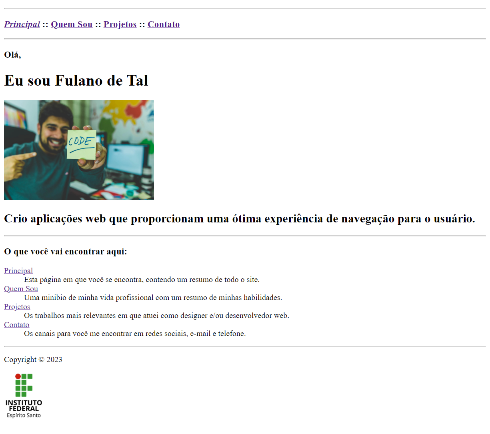
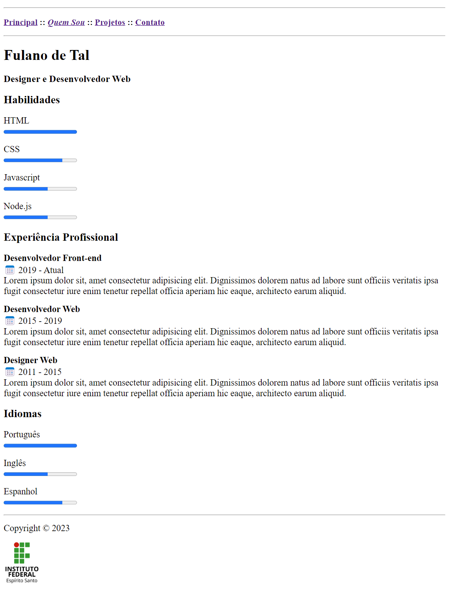
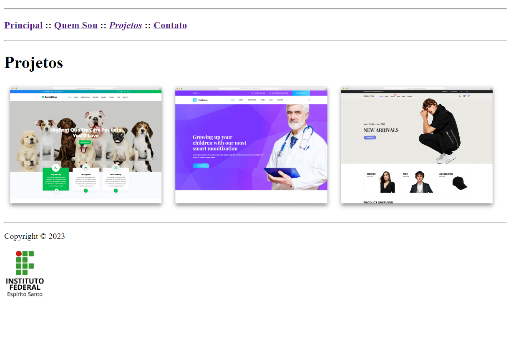
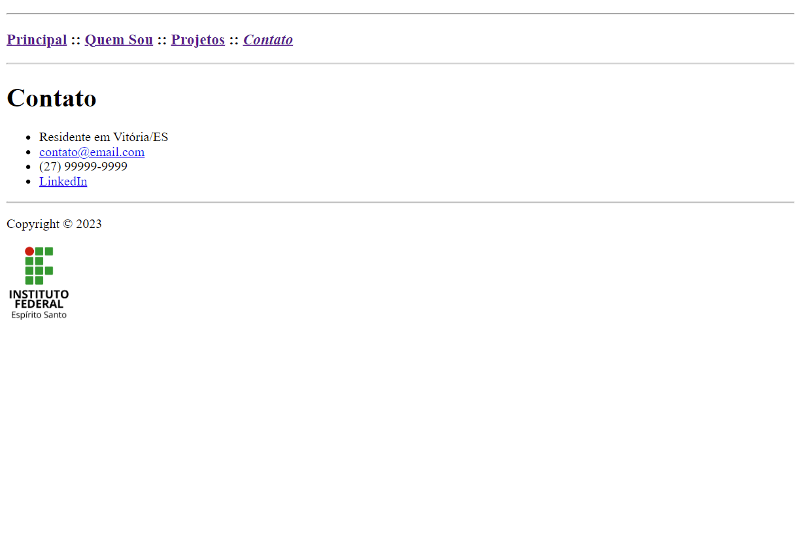

# Atividade Prática da Semana 1

Um dos sites mais importantes para um programador profissional é aquele para expor o seu portfólio. Trata-se de algo essencial para ser notado e para estabelecer sua presença online, mostrando habilidades, projetos em que participou e disponibilizando canais para contato. Um portfólio pode te ajudar a encontrar um trabalho, um estágio ou um programa de bolsa de estudos. Portanto, vamos entender como se constrói um site de portfólio simples.

Um site de portfólio deve ter ao menos 4 elementos essenciais: uma _hero section_, que é uma seção que mostra de forma destacada o perfil do profissional e convida o usuário a alguma ação; uma seção com informações sobre as habilidades relevantes do profissional; uma seção informando os projetos mais relevantes em que o profissional já atuou; e, por fim, uma seção que apresente todos os canais de contato possíveis para se comunicar com o profissional.

As imagens a seguir são de um site de portfólio pessoal que usa somente os elementos HTML que foram vistos ao longo do conteúdo dessa semana. Complete as 4 páginas HTML deste repositório (index.html, quemsou.html, projetos.html e contato.html) de forma que eles se tornem visualmente idênticos às das figuras mostradas ao fim deste documento. Lembre-se de usar as boas práticas mencionadas ao longo das aulas, incluindo a preocupação com a semântica dos elementos HTML. Agora vamos a algumas dicas importantes que você deve observar ao construir as páginas:

1) Complete as páginas na seguinte ordem: index.html, quemsou.html, projetos.html e contato.html . Você vai perceber que conseguirá reaproveitar alguns códigos entre as páginas se seguir esta ordem.
2) Cada item do menu na barra de navegação superior deve abrir a página correspondente ao seu título e deve ficar em itálico quando corresponder à página que estiver sendo exibida.
3) Substitua a foto da página principal por outra de sua preferência. De preferência, use uma foto sua. Se não tiver uma boa foto no momento, você pode encontrar outras boas fotos em https://www.pexels.com/ .
   
Agora veja, no restante desse documento, as capturas de tela das páginas prontas e dê o seu melhor para conseguir reproduzir o que é mostrado. Bons estudos!

## Página index.html

## Página quemsou.html

## Página projetos.html

## Página contato.html
