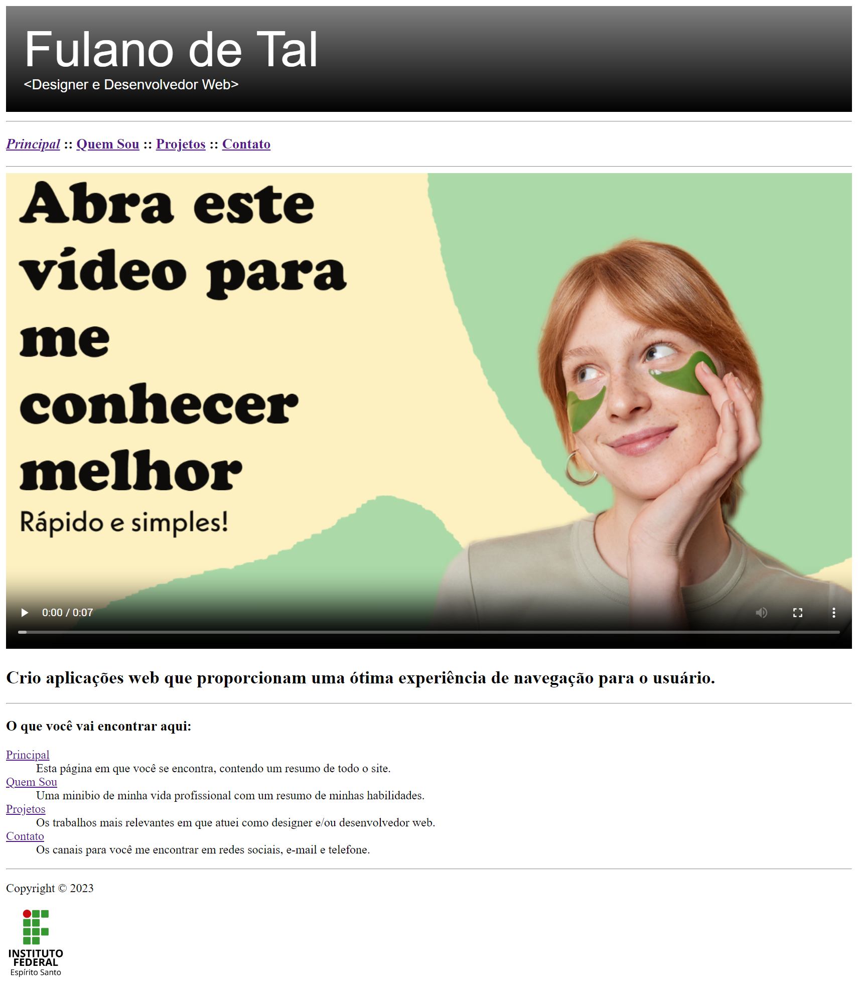
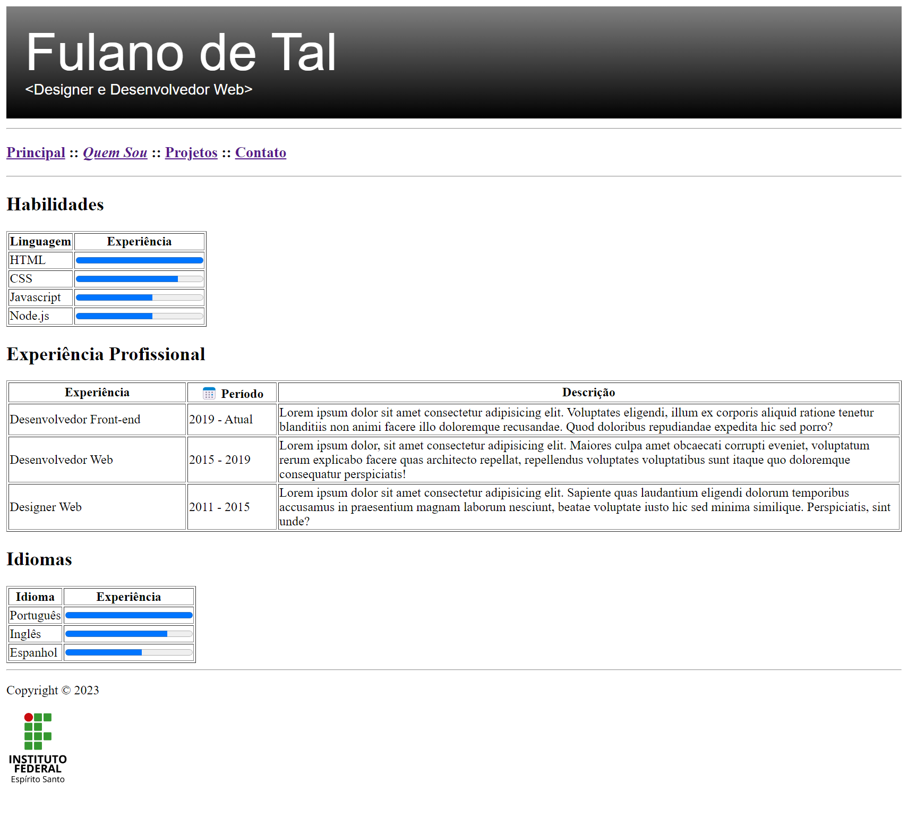
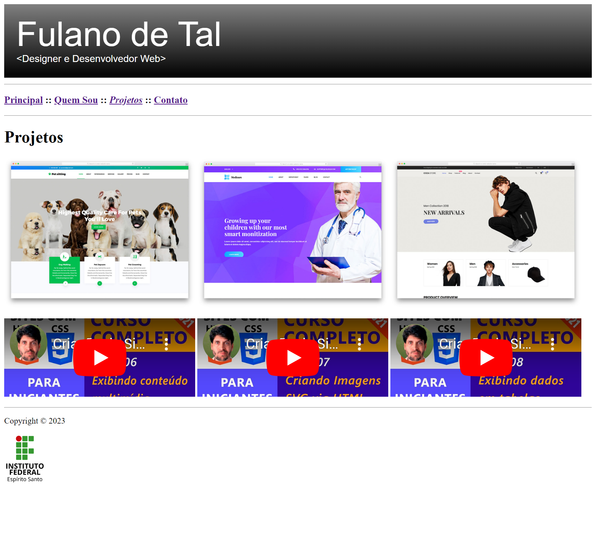
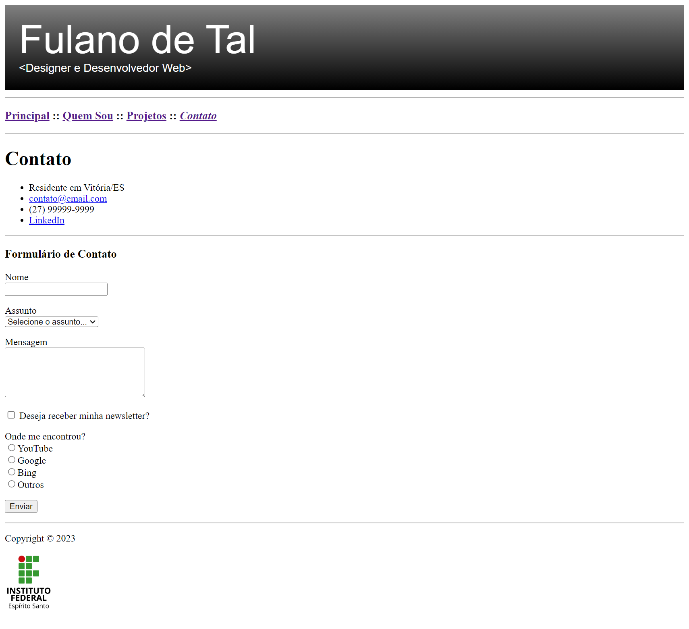

# Atividade Prática da Semana 2   Valor: 10 pontos

Na semana 1, a atividade prática consistiu na criação de um site muito simples para apresentar o portfólio de um desenvolvedor web, usando um conjunto bastante limitado de elmentos HTML. Agora que vimos mais alguns elementos HTML, incluindo elementos para exibição de vídeos, imagens SVG, tabelas e formulários, vamos aprimorar o projeto da semana 1.

As figuras a seguir mostram o site de portfólio feito somente com HTML e usando somente os elementos que estudamos nas semanas 1 e 2. Antes de cada uma das figuras a seguir, você verá uma descrição do que a página contém de diferente para a página correspondente criada na semana 1, e que você deverá fazer para completar a atividade desta semana 2.
   
## Página index.html

1. Nesta página, a primeira coisa a ser feita é a adição da imagem "header.svg" ao topo da página. Porém, antes disso, baixe ela para seu computador, abra-a em um editor de textos (Bloco de Notas, Visual Studio Code etc.) e troque o nome "Fulano de Tal" pelo seu nome. Feito isso, suba com a imagem novamente para o Repl.it e use-a como cabeçalho de **TODAS** as 4 páginas do site. (2 pontos)

2. Substitua a imagem do desenvolvedor que estava localizada logo abaixo da barra de navegação pelo vídeo "video-hd.mp4", de forma que ele ocupe 100% da largura da página. Use a imagem "poster.png" para criar a capa do vídeo. (2 pontos)

## Página quemsou.html

3. Substitua os itens das seções "Habilidades", "Experiência Profissional" e "Idiomas" por tabelas, conforme a figura a seguir. Use os elementos semânticos para compor a tabela corretamente e adicione o atributo de borda para deixar a tabela bem visível. Você pode usar o atributo _width_ nas células de título das colunas com um valor em percentual para modificar a largura de cada coluna. Por exemplo, _width="15%"_. (2 pontos)

## Página projetos.html

4. Adicione 3 vídeos incorporados do YouTube (diferentes) à sua escolha, de forma que eles fiquem dispostos conforme a figura a seguir, alinhados com as imagens dos sites. (2 pontos)

## Página contato.html

5. Adicione um formulário de contato conforme a figura a seguir. Observe atentamente o tipo de cada campo. No campo _Assunto_, as possíveis opções são "Sugestão", "Reclamação", "Orçamento" e "Outros". (2 pontos)

## Observações

Procure concluir as atividades de forma que o resultado visual fique o mais fiel possível às imagens das páginas apresentadas acima. Veja a seguir os critérios de correção das questões (rubricas):

### Questão 1
| Situação | Pontuação |
| :--- | :---: |
| Não adicionou o cabeçalho SVG | 0.0 |
| Adicionou em algumas páginas, mas não modificou o nome _Fulano de Tal_ | 0.5 |
| Adicionou em todas as páginas, mas não modificou o nome _Fulano de Tal_ | 1.0 |
| Adicionou em algumas páginas e modificou o nome _Fulano de Tal_ | 1.5 |
| Adicionou em todas as páginas e modificou o nome _Fulano de Tal_ | 2.0 |

### Questão 2
| Situação | Pontuação |
| :--- | :---: |
| Não adicionou o vídeo | 0.0 |
| Adicionou o vídeo, está sem capa e não está ocupando toda a largura da página | 0.5 |
| Adicionou o vídeo, está com capa e não está ocupando toda a largura da página | 1.0 |
| Adicionou o vídeo, está com capa e está ocupando toda a largura da página | 2.0 |

### Questão 3
| Situação | Pontuação |
| :--- | :---: |
| Não adicionou tabelas para as seções | 0.0 |
| Adicionou tabelas mal formatadas e sem elementos semânticos apenas para algumas seções | 0.5 |
| Adicionou tabelas bem formatadas e sem elementos semânticos apenas para algumas seções | 1.0 |
| Adicionou tabelas bem formatadas e sem elementos semânticos para as 3 seções | 1.5 |
| Adicionou tabelas bem formatadas e com elementos semânticos para as 3 seções | 2.0 |

### Questão 4
| Situação | Pontuação |
| :--- | :---: |
| Não adicionou os vídeos incorporados | 0.0 |
| Adicionou os vídeos, porém, dispostos de forma diferente do que foi pedido | 1.0 |
| Adicionou os vídeos dispostos conforme foi pedido | 2.0 |

### Questão 5
| Situação | Pontuação |
| :--- | :---: |
| Não adicionou formulário de contato | 0.0 |
| Adicionou alguns campos do formulário de contato, porém, com tipos incorretos | 0.5 |
| Adicionou todos os campos do formulário de contato, porém, com tipos incorretos | 1.0 |
| Adicionou todos campos do formulário de contato usando os tipos corretos | 2.0 |