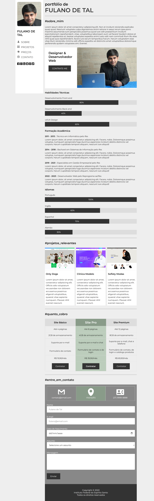

# Atividade Prática da Semana 4   Valor: 15 pontos

Na semana anterior, você completou um site de portfólio com 4 páginas modificando o arquivo CSS vinculado a ele. Na atividade dessa semana, trabalharemos no mesmo site de portfólio, porém, em um formato mais moderno, que é o formato de página única. Neste tipo de site, todas as seções ficam em uma única página. Nossa tarefa será usar os conhecimentos aprendidos ao longo da semana 4 para dimensionar e posicionar corretamente as regiões que compõem essa página.

Assim como na atividade da semana 3, o único arquivo que você deverá modificar é o arquivo "estilos.css". Os demais arquivos (imagens, index.html etc.) já estão adequados para o site. São 15 propriedades que devem ser definidas de acordo com os comentários que estão presentes no próprio arquivo CSS. Cada propriedade definida corretamente vale 1 ponto, perfazendo um total de 15 pontos. Portanto, chegou a hora de abrir o arquivo **estilos.css** e começar a fazer a atividade. Não se esqueça de submeter a atividade até o fim do prazo estipulado e de verificar se as configurações que você está fazendo estão deixando as páginas com o mesmo visual da página mostrada na figura abaixo.

Bons estudos!

## Página index.html

