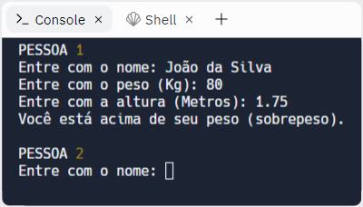

### EXERCÍCIOS (AULA 12 - FUNÇÕES)

1.	O Índice de Massa Corporal (IMC) é uma medida do grau de obesidade uma pessoa. Através do cálculo de IMC é possível saber se alguém está acima ou abaixo dos parâmetros ideais de peso para sua estatura. Calcular IMC requer a aplicação de uma fórmula que leva em conta seu peso e altura. IMC é igual ao peso dividido pelo quadrado da altura (IMC = peso / (altura*altura)).
 

| IMC            | Código | Descrição|
|----------------|--------|----------|
|Abaixo de 18,5|1|Você está abaixo do peso ideal!|
|Entre 18,5 e 24,9|2|Parabéns! Você está em seu peso normal!|
|Entre 25,0 e 29,9|3|Você está acima de seu peso (sobrepeso)!|
|Acima 29,9|4|Obesidade!|

a)	Faça uma função para calcular o IMC. Esta função deve receber como parâmetros o peso e a altura de uma determinada pessoa, e retornar o IMC.

b)	Faça outra função para verificar a situação. Esta função deve receber como parâmetro o IMC, e retornar um código (1, 2, 3 ou 4) de acordo com a situação da pessoa que possui estas medidas.

c)	Faça um procedimento para exibir descrição da situação. Este procedimento deve receber como parâmetro o código da situação da pessoa, e exibir na tela o texto com a descrição da situação de uma determinada pessoa. 

Considerando a existência dessas duas funções e do procedimento, o seu algoritmo deve receber dados de 5 pessoas com relação ao nome, peso e a altura. Imediatamente após a digitação dos dados de cada pessoa deve ser informada a descrição da sua situação com relação ao IMC. Exemplo:

