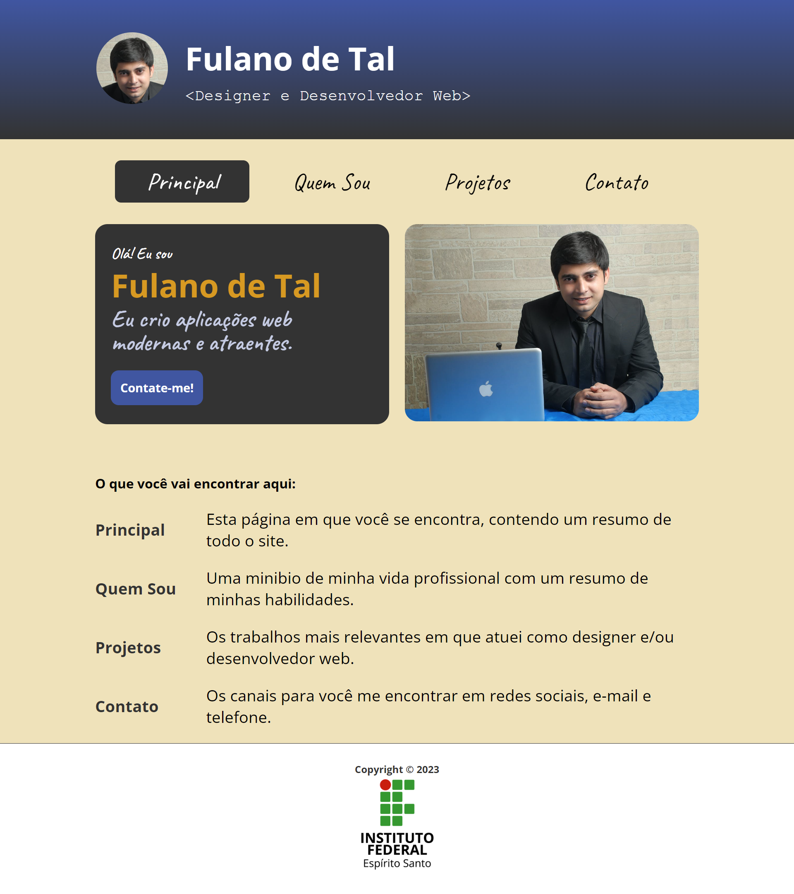
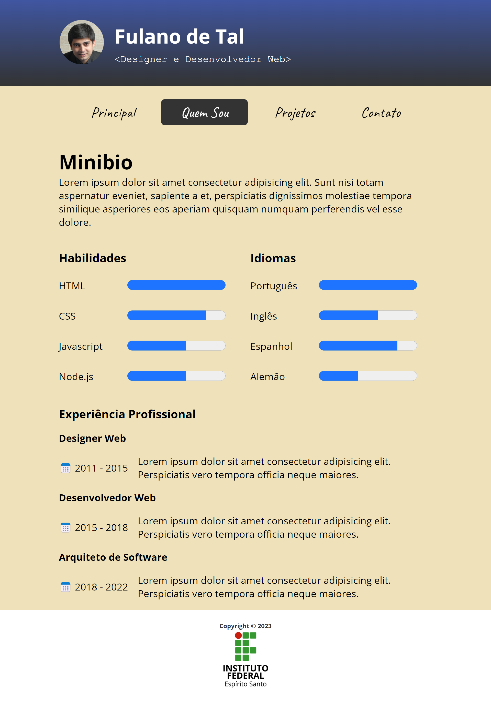
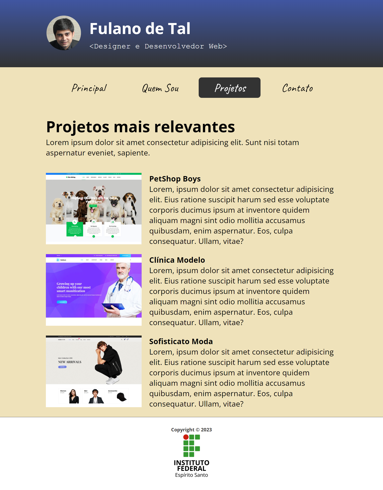
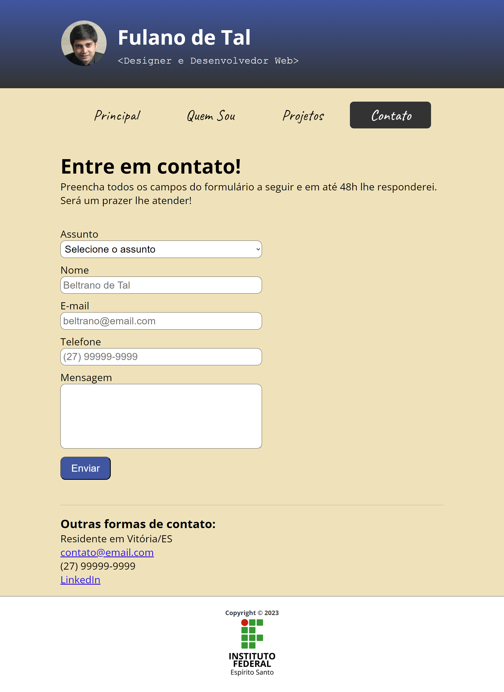

# Atividade Prática da Semana 3   Valor: 10 pontos

Na semana anterior, você fez um site de portfólio com 4 páginas usando somente HTML e imagens. Agora que você já iniciou os estudos de CSS, nós vamos aprimorar o site construído na semana 2. Mas antes de colocarmos a mão na massa, vamos a algumas considerações importantes. Uma das questões mais complicadas ao se fazer um site construído com HTML puro é a criação do leiaute da página, ou seja, a divisão da página em regiões. Há muitos anos, a técnica mais comum para se dividir uma página em regiões era através do uso de tabelas HTML. 

Entretanto, nas últimas duas décadas, o leiaute _tableless_, ou seja, sem o uso de tabelas, é o que tem sido adotado pelos web designers, por apresentar vantagens relevantes em relação ao leiaute com tabelas. Porém, para se construir um leiaute _tableless_, precisamos de conhecimentos que só aprenderemos nas próximas duas semanas. Na tarefa desta semana, nós voltaremos no tempo e recriaremos o site de portfólio usando o preterido leiaute baseado em tabelas, que já está pronto na atividade. As figuras a seguir apresentam as capturas de tela das páginas do site de portfólio desta semana já pronto, aprimorado com CSS e usando o leiaute baseado em tabelas.

Nesta atividade, o site está semipronto, faltando somente complementar o arquivo CSS. Observe a estrutura de arquivos. Além das 4 páginas HTML, que já estão prontas, temos a pasta _img_, que contém as imagens do site, e a pasta _css_, que contém somente o arquivo _estilos.css_. É neste arquivo **estilos.css** você vai trabalhar. Já no início deste arquivo, você vai encontrar um comentário numerado indicando o que deve ser feito e qual é a pontuação atribuída a esta tarefa. Ao longo do arquivo, você encontrará mais comentários numerados indicando que deve ser criado um seletor CSS com determinado escopo e com determinadas configurações de propriedades. Cada comentário numerado corresponde à uma questão da atividade e possui pontuação variável, informada logo abaixo da questão. 

Agora, chegou a hora de abrir o arquivo **estilos.css** e começar a fazer a atividade. Não se esqueça de submeter a atividade até o fim do prazo estipulado e de verificar se as configurações que está fazendo estão deixando as páginas com o mesmo visual das figuras abaixo.

Bons estudos!

## Página index.html

## Página quemsou.html

## Página projetos.html

## Página contato.html

